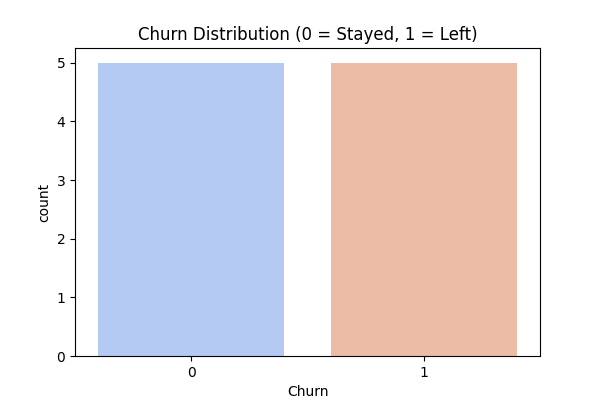
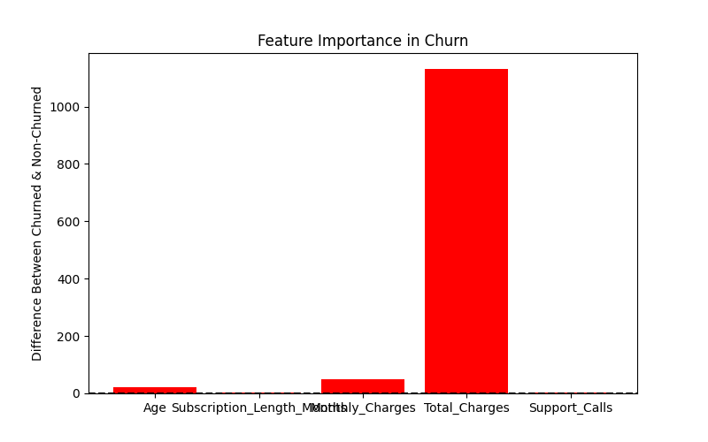

# 📊 Customer Churn Analysis

## 📌 Project Overview
Customer churn is a major concern for businesses, as retaining customers is often more cost-effective than acquiring new ones. This project analyzes customer churn data to identify key factors contributing to customer attrition. The analysis includes exploratory data analysis (EDA), feature importance evaluation, and visual insights.

## 🚀 Key Features
- **Churn Distribution Analysis** → Visualizes the number of churned vs. non-churned customers.
- **Feature Importance Analysis** → Identifies which customer attributes influence churn the most.
- **Data Cleaning & Preprocessing** → Ensures accurate and reliable data analysis.
- **Data Visualization** → Uses Matplotlib & Seaborn to generate insightful charts.

## 🏗️ Technologies Used
- **Python** → Data processing and analysis.
- **pandas** → Data wrangling and manipulation.
- **matplotlib & seaborn** → Data visualization.

## 📂 Folder Structure
```
Customer_Churn_Analysis/
│── data/
│   ├── customer_churn.csv   # Dataset file
│── images/
│   ├── churn_distribution.png   # Visualization of churned vs. non-churned customers
│   ├── feature_importance.png   # Visualization of key churn factors
│── scripts/
│   ├── churn_analysis.py   # Python script for analysis
│── README.md   # Project documentation
│── requirements.txt   # Python dependencies
```

## 📥 Installation & Setup
To run this project on your local system:

1. **Clone the Repository**
   ```bash
   git clone https://github.com/VIGNESH54/Customer_Churn_Analysis.git
   cd Customer_Churn_Analysis
   ```
2. **Create & Activate Virtual Environment**
   ```bash
   python3 -m venv venv
   source venv/bin/activate  # macOS/Linux
   venv\Scripts\activate  # Windows
   ```
3. **Install Dependencies**
   ```bash
   pip install -r requirements.txt
   ```
4. **Run the Analysis Script**
   ```bash
   python scripts/churn_analysis.py
   ```

## 📊 Sample Output & Insights
### **1️⃣ Churn Distribution**

- Shows the proportion of customers who stayed vs. those who left.

### **2️⃣ Feature Importance in Churn**

- Highlights which factors (e.g., Monthly Charges, Support Calls) impact churn the most.

## 🎯 Business Impact
This analysis helps businesses:
- **Identify high-risk customers** likely to churn.
- **Improve customer retention strategies** by targeting key risk factors.
- **Optimize customer service** based on churn insights.

## 🤝 Contribution
Feel free to fork this project, submit pull requests, or reach out for collaborations.

## 📞 Contact
**GitHub:** [VIGNESH54](https://github.com/VIGNESH54)  
**Email:** vignesh23557@gmail.com

